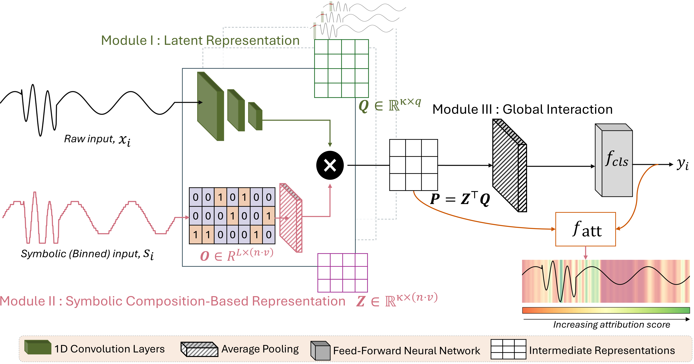

# TimeSliver

**TimeSliver** is a novel time series classification model with built-in temporal attribution for interpretability. It uses SAX (Symbolic Aggregate approXimation) encoding and multi-scale motif detection to classify time series data.

## Overview

TimeSliver identifies which time points in a sequence are most important for classification decisions. The model architecture combines:
- **SAX Encoding**: Discretizes continuous time series into symbolic representations
- **Multi-scale CNNs**: Captures motifs at different temporal scales
- **Motif-Document Interaction**: Learns relationships between CNN features and SAX representations
- **Temporal Attribution**: Computes per-time-point importance scores

## Architecture




## Workflow Diagram

```
┌─────────────────────────────────────────────────────────────┐
│                    TRAINING PIPELINE                        │
├─────────────────────────────────────────────────────────────┤
│                                                             │
│  ┌──────────────┐    ┌──────────────┐    ┌──────────────┐  │
│  │ 1. Train     │───▶│ 2. Test      │───▶│ 3. Temporal  │  │
│  │    Model     │    │    Model     │    │  Attribution │  │
│  └──────────────┘    └──────────────┘    └──────────────┘  │
│                                                 │           │
│                                                 ▼           │
│                                        ┌──────────────┐     │
│                                        │ importance_  │     │
│                                        │ {split}.npy  │     │
│                                        └──────────────┘     │
│                                                 │           │
│                                                 ▼           │
│  ┌──────────────────────────────────────────────────────┐  │
│  │              MASKED TRAINING (Optional)               │  │
│  ├──────────────────────────────────────────────────────┤  │
│  │  ┌──────────────┐         ┌──────────────┐           │  │
│  │  │ 4. Train     │────────▶│ 5. Test      │           │  │
│  │  │  w/ Masking  │         │  w/ Masking  │           │  │
│  │  └──────────────┘         └──────────────┘           │  │
│  └──────────────────────────────────────────────────────┘  │
│                                                             │
└─────────────────────────────────────────────────────────────┘
```

---

## Dataset Parameters

| Dataset           | Classes | Bins (n) | Positional Encoding |
|------------------|---------|----------|----------------------|
| EEG Sleep Stage  | 5       | 25       | Yes                  |
| FordA            | 2       | 40       | No                   |
| FreqSum          | 2       | 90       | No                   |
| SeqComb-MV       | 4       | 20       | Yes                  |
| SeqComb-UV       | 4       | 20       | Yes                  |
| LowVar           | 4       | 40       | No                   |
| Audio            | 10      | 10       | No                   |

## Installation

### 1. Clone the Repository
```bash
git clone <repository-url>
cd TimeSliver
```

### 2. Create Conda Environment
```bash
conda env create -f environment.yml
conda activate torch
```

### 3. Prepare Data
Place your data files in the respective `data/` folders:
- `x_train.npy`, `x_valid.npy`, `x_test.npy` - Input features
- `y_train.npy`, `y_valid.npy`, `y_test.npy` - Labels
- `sax_train.npy`, `sax_valid.npy`, `sax_test.npy` - SAX-encoded data

## Usage

### Quick Start (Any Dataset)

Replace `<dataset>` with: `eeg_sleepstage_classification`, `fordA`, `synthetic_data`, `seqcomb_mv`, `seqcomb_uv`, or `larvar`

```bash
cd <dataset>/main

# Step 1: Train the model
python train_model.py --device cuda

# Step 2: Test the model
python test_model.py --device cuda

# Step 3: Compute temporal attribution scores
python temporal_attribution.py --split all --device cuda
```

---

## Detailed Instructions by Dataset

### EEG Sleep Stage Classification

```bash
cd eeg_sleepstage_classification/main

# Train base model
python train_model.py --epochs 2500 --lr 0.0005 --device cuda

# Test on test set
python test_model.py --device cuda

# Compute attribution scores for all splits
python temporal_attribution.py --split all --device cuda

# Train with masking (using top 20% important time points)
python train_with_masking.py --top-percent 20 --device cuda

# Test masked model
python test_with_masking.py --device cuda
```

### FordA Dataset

```bash
cd fordA/main

# Train base model
python train_model.py --epochs 2500 --lr 0.001 --device cuda

# Test on test set
python test_model.py --device cuda

# Compute attribution scores
python temporal_attribution.py --split all --device cuda

# Train with masking
python train_with_masking.py --top-percent 30 --device cuda

# Test masked model
python test_with_masking.py --device cuda
```

### FreqSum Data

```bash
cd synthetic_data/main

# Train base model
python train_model.py --epochs 2500 --lr 0.001 --device cuda

# Test on test set
python test_model.py --device cuda

# Compute attribution scores
python temporal_attribution.py --split all --device cuda

# Train with masking
python train_with_masking.py --top-percent 20 --device cuda

# Test masked model
python test_with_masking.py --device cuda
```

### SeqComb-MV (Multivariate)

```bash
cd seqcomb_mv/main

# Train model
python train_model.py --epochs 2500 --lr 0.002 --device cuda

# Test on test set
python test_model.py --device cuda

# Compute attribution scores
python temporal_attribution.py --split all --device cuda
```

### SeqComb-UV (Univariate)

```bash
cd seqcomb_uv/main

# Train model
python train_model.py --epochs 2500 --lr 0.002 --device cuda

# Test on test set
python test_model.py --device cuda

# Compute attribution scores
python temporal_attribution.py --split all --device cuda
```

### LowVar Dataset

```bash
cd larvar/main

# Train model
python train_model.py --epochs 2500 --lr 0.002 --device cuda

# Test on test set
python test_model.py --device cuda

# Compute attribution scores
python temporal_attribution.py --split all --device cuda
```

---

## Command Line Arguments

### train_model.py
| Argument | Default | Description |
|----------|---------|-------------|
| `--epochs` | 2500 | Number of training epochs |
| `--lr` | varies | Learning rate |
| `--batch-size` | varies | Batch size for training |
| `--device` | auto | Device (cuda, cuda:0, cpu) |
| `--d-out` | varies | CNN output channels |
| `--max-m` | 1 | Number of motif scales |
| `--no-tensorboard` | - | Disable TensorBoard logging |

### test_model.py
| Argument | Default | Description |
|----------|---------|-------------|
| `--split` | test | Data split (train, valid, test) |
| `--batch-size` | varies | Batch size for testing |
| `--device` | auto | Device to use |
| `--model-path` | best.pth | Path to model checkpoint |

### temporal_attribution.py
| Argument | Default | Description |
|----------|---------|-------------|
| `--split` | all | Split to process (train, valid, test, all) |
| `--batch-size` | 1024 | Batch size for processing |
| `--device` | auto | Device to use |
| `--model-path` | best.pth | Path to model checkpoint |

### train_with_masking.py (EEG, FordA, Synthetic only)
| Argument | Default | Description |
|----------|---------|-------------|
| `--top-percent` | required | Percentage of top time points to keep (1-100) |
| `--method` | main | Attribution method (main, transformer, captum) |
| `--sub-method` | None | Sub-method for transformer/captum |
| `--epochs` | varies | Number of training epochs |

### test_with_masking.py (EEG, FordA, Synthetic only)
| Argument | Default | Description |
|----------|---------|-------------|
| `--split` | test | Data split to evaluate |
| `--top-percent` | saved | Override masking percentage |
| `--method` | saved | Override attribution method |

---

## Output Files

After training and attribution, the following files are saved in the `model/` directory:

| File | Description |
|------|-------------|
| `best.pth` | Best model checkpoint (base training) |
| `best_masking.pth` | Best model checkpoint (masked training) |
| `save_dict.npy` | Model configuration (q, d, max_m) |
| `init_lr.npy` | Initial learning rate |
| `importance_train.npy` | Attribution scores for training set |
| `importance_valid.npy` | Attribution scores for validation set |
| `importance_test.npy` | Attribution scores for test set |
| `predicted_label.npy` | Predicted labels from testing |

---


## Notes

- **Model checkpoints**: Automatically saved when validation accuracy improves.
- **Attribution scores**: Higher values indicate more important time points for classification.

## Documentation

Each dataset folder contains a `claude.md` file with detailed documentation specific to that dataset, including architecture details and parameter descriptions.


## Citation

If you use TimeSliver in your research, please cite:

```bibtex
@inproceedings{
pandey2026timesliver,
title={{TIMESLIVER}: {SYMBOLIC}-{LINEAR} {DECOMPOSITION} {FOR} {EXPLAINABLE} {TIME} {SERIES} {CLASSIFICATION}},
author={Akash Pandey and Payal Mohapatra and Wei Chen and Qi Zhu and Sinan Keten},
booktitle={The Fourteenth International Conference on Learning Representations},
year={2026},
url={https://openreview.net/forum?id=MDRp9XhGtS}
}
```
